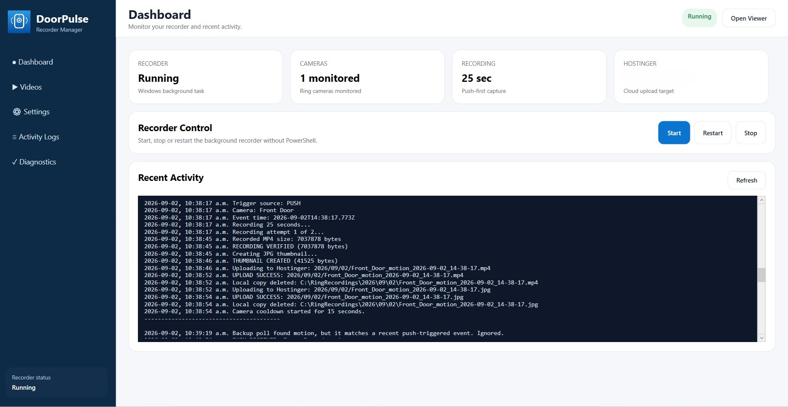
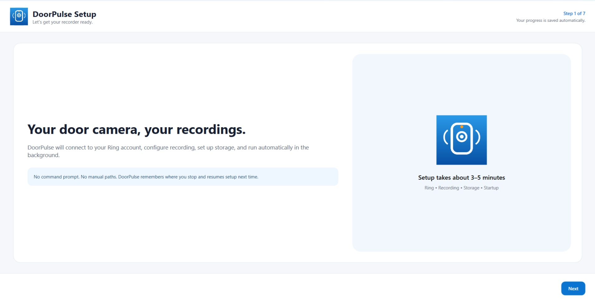
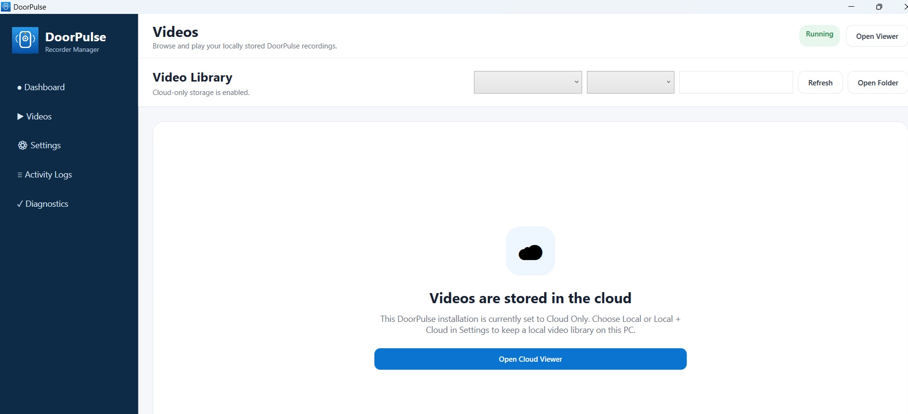

# DoorPulse

**Windows recorder and video manager for Ring cameras**

DoorPulse is a Windows application that can automatically record Ring motion and doorbell events, create video thumbnails, and save recordings locally, in cloud storage, or both.

> DoorPulse is an independent project and is not affiliated with, endorsed by, or supported by Ring LLC or Amazon.

## Download

### Latest Version: DoorPulse v1.0.0

[Download DoorPulseSetup.exe](https://github.com/samirslike/DoorPulse/releases/latest/download/DoorPulseSetup.exe)

Download the installer, double-click it, approve the Windows administrator prompt, and follow the DoorPulse Setup Wizard.

## Features

- True push-first Ring motion detection
- Doorbell press recording
- 60-second backup event polling
- Multi-camera support
- 15 / 25 / 45 second recording options
- Automatic MP4 recording
- Automatic JPG thumbnails
- Local storage
- Cloud storage
- Local + Cloud storage
- Built-in Videos library
- Fullscreen video player
- Automatic recorder restart
- Background watchdog recovery
- Windows Setup Wizard
- No command line required for normal users

## Screenshots

### Dashboard



### Setup Wizard



### Videos



## How It Works

```text
Ring Motion / Doorbell
        ↓
Instant Ring Push
        ↓
DoorPulse
        ↓
Live View Recording
        ↓
MP4 + Thumbnail
        ↓
Local / Cloud / Both
```

DoorPulse uses push notifications as the primary trigger.

A periodic Ring event-history check is also used as a backup in case a push notification is missed.

## Installation

1. Download `DoorPulseSetup.exe`
2. Double-click the installer
3. Approve the Windows administrator prompt
4. Connect your Ring account
5. Complete Ring two-factor authentication if required
6. Select the Ring cameras to monitor
7. Choose the recording duration
8. Choose Local, Cloud, or Both storage
9. Finish setup

DoorPulse then runs automatically in the background.

## Storage Options

### Local

Recordings remain on the Windows PC and are available from the DoorPulse **Videos** menu.

### Cloud

Recordings are uploaded to configured remote storage.

### Both

DoorPulse keeps a local copy and uploads another copy to remote storage.

## Automatic Recovery

DoorPulse is designed for continuous recording.

If the background recorder stops unexpectedly, DoorPulse uses automatic restart settings and a watchdog to bring the recorder back online.

## Windows Security Warning

DoorPulse is currently distributed as an unsigned Windows application.

Windows SmartScreen may display an **Unknown Publisher** warning during installation.

A digitally signed installer is planned for a future release.

## Current Version

**v1.0.0**

This is the first public DoorPulse release and the project is under active development.

## Support / Problems

If you encounter a problem, please use the **Issues** section of this GitHub repository.

When reporting a problem, do not post:

- Ring passwords
- Ring two-factor authentication codes
- Ring refresh tokens
- FTP passwords
- Private account information

## Acknowledgements

DoorPulse uses the open-source `ring-client-api` ecosystem for Ring integration.

Thank you to the maintainers and contributors of those projects for making applications like DoorPulse possible.

## Disclaimer

DoorPulse is an unofficial third-party application.

Ring is a trademark of Ring LLC / Amazon. DoorPulse is not affiliated with, sponsored by, endorsed by, or supported by Ring LLC or Amazon.
